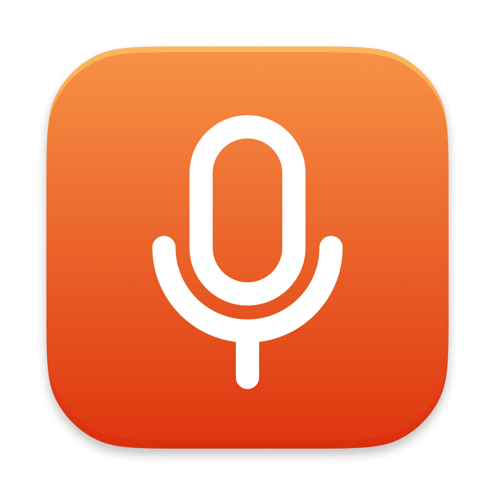

# LoudMic



A tiny macOS menu bar app that keeps your microphone volume where you want it.

Some apps and system events love to quietly reset your mic input level. LoudMic fights back by re-applying your chosen volume (100% or 80%) every few seconds, so your calls and recordings stay consistent.

**Requires macOS 15 (Sequoia) or later.**

## Install

```sh
curl -fsSL https://raw.githubusercontent.com/vladstudio/loudmic/main/install.sh | bash
```

## Features

- Lives in the menu bar -- no dock icon, no windows
- Choose between 100% and 80% mic volume
- Enforces your choice continuously so nothing can silently change it
- Optional start-on-login
- Auto-update from GitHub releases

#### License

MIT -- see [LICENSE](LICENSE).
